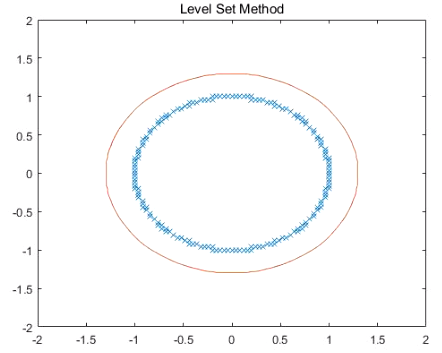
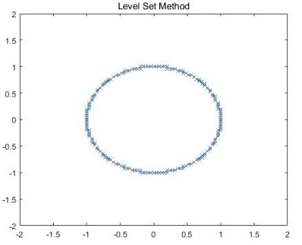

# Shape Reconstruction via Level Set Method

## About the Project

This project is for implementing Shape reconstruction program via level set method. It is based on a paper written by H. Zhao(2000).

## Algorithm
Goal: Shape Reconstruction form an unorganized data set.

key Idea: Want to find a function on an image whose zero level set is nearly the same as what we want to reconstruct.

To do this, we define a functional that measures how well a function reconstruct a shape. Let  be an unorganized data set and  be a zero level set of a function. Given a point  on ,  define &space;=&space;dist(x,&space;S)$) and =\big[&space;\int_{\Gamma}d^p(x)ds&space;\big]^{1/p}$). Then  is non-negative and if  is close to ,  is close to 0. It means that  is an appropriate functional for shape reconstruction.

To minimize this functional, we use Level Set Method. If you want more detalis, see the [paper](https://www.math.uci.edu/~zhao/publication/mypapers/pdf/surface1.pdf).

## How to run

There is one main file named 'shape_reconstruction' and 4 sample data for input. You can change the input in the main file. You also can change a hyper-parameter p.

## Result

Here are some sample results.

   
    
   <b>Case 1. circle(before)</b> 
 

 

   
    
   <b>Case 1. circle(after)</b> 
 

You can see the red curve converges to the data points.

## Acknowledgement

This project is collaborated with Kwanghyun Choi(Seoul National University).

## Reference

[1] H. Zhao, et al. Implicit and Nonparametric Shape Reconstruction from Unorganized Data Using a Variational Level Set Method. Computer Vision and Image Understanding 80, 295–314 (2000).
